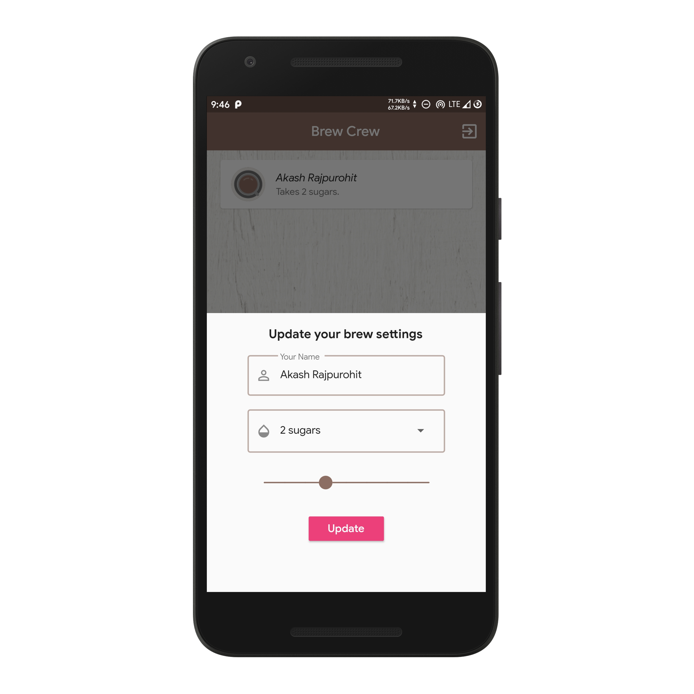

# Brew Crew

A new Flutter and Firebase project developed when I started learning integrating firebase as backend for flutter applications

# App Screenshots

# Screenshots
Register     	      	     |  Sign In
:-------------------------:|:-------------------------:
  |  

Loading              	 |   Home Screen                           
:---------------------:|:--------------------:
  | 

Settings Form          |   Updating Settings Form                           
:---------------------:|:--------------------:
  | 

# Donate
> If you found this project helpful or you learned something from the source code and want to thank me, consider buying me a cup of :coffee:
>
> - [PayPal](https://www.paypal.me/RajpurohitAkash/)

# Download
You can [download](https://github.com/AkashRajpurohit/Brew_Crew/releases/download/v1.0.0/app-arm64-v8a-release.apk) the application for android and try the it yourself.

# Bugs or Requests

If you encounter any problems feel free to open an [issue](https://github.com/AkashRajpurohit/Brew_Crew/issues/new). Pull requests are also welcome.

## Visit My Portfolio
[Akash Rajpurohit](https://akashrajpurohit.cf)
